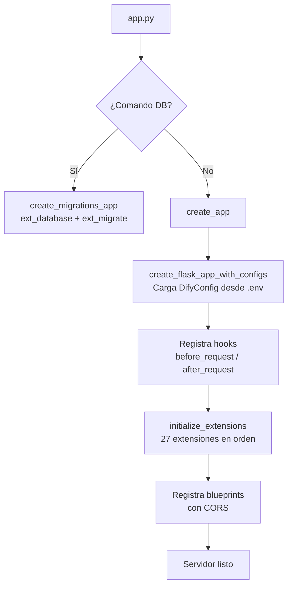

# Backend Overview — Dify

## 1. Arquitectura General

Dify es una plataforma LLM-ops. Su backend es una aplicación **Python/Flask** desacoplada del frontend (Next.js). Se comunica con el frontend exclusivamente vía REST API.

```mermaid
graph TB
    subgraph Clients
        FE[Frontend Next.js\n:3000]
        CLI[SDK / CLI]
        EXT[Servicios Externos]
    end

    subgraph Dify API [:5001]
        APP[Flask App\napp.py / app_factory.py]
        subgraph Blueprints
            CON[/console/api — Console]
            SVC[/api — Service API]
            WEB[/ — Web App]
            FILES[/files — Files]
            MCP[/mcp — MCP]
            TRG[/trigger — Triggers]
        end
        APP --> CON & SVC & WEB & FILES & MCP & TRG
    end

    subgraph Workers
        CEL[Celery Workers\ncelery_entrypoint.py]
        BEAT[Celery Beat\nScheduler]
    end

    subgraph Storage
        PG[(PostgreSQL\nDatos relacionales)]
        RD[(Redis\nCache + Cola)]
        VEC[(Vector Store\nWeaviate / Milvus / pgvector)]
        FS[File Storage\nS3 / Azure / GCS / local]
    end

    FE & CLI --> APP
    APP <--> PG & RD & VEC & FS
    APP -->|Encola tareas| RD
    CEL -->|Consume de| RD
    CEL <--> PG & VEC & FS
    BEAT --> RD
```

## 2. Estructura de Directorios del Backend

```
api/
├── app.py                    # Entry point (Flask o migrations)
├── app_factory.py            # App factory — registra extensiones
├── celery_entrypoint.py      # Entry point del worker Celery
├── dify_app.py               # Subclase Flask personalizada
├── pyproject.toml            # Dependencias (Python >=3.12)
├── gunicorn.conf.py          # Config WSGI para producción
│
├── configs/                  # Pydantic BaseSettings — configuración
│   ├── app_config.py         # DifyConfig (clase principal)
│   ├── deploy/               # DB, Redis, Storage
│   ├── feature/              # Feature flags
│   ├── middleware/           # Middlewares
│   ├── observability/        # OTEL, Sentry
│   └── remote_settings_sources/  # Apollo / Nacos
│
├── controllers/              # Handlers HTTP (Flask-RESTX)
│   ├── console/              # APIs del panel de administración
│   ├── service_api/          # API pública para integraciones
│   ├── web/                  # APIs del chat web
│   ├── files/                # Upload / download
│   ├── mcp/                  # Model Context Protocol
│   └── trigger/              # Webhooks y triggers
│
├── models/                   # SQLAlchemy ORM (21 archivos)
├── services/                 # Lógica de negocio (50+ clases)
├── core/                     # Motor de ejecución LLM y RAG
├── tasks/                    # Tareas Celery asíncronas
├── schedule/                 # Tareas Celery Beat (periódicas)
├── extensions/               # Inicialización de extensiones Flask
├── repositories/             # Capa de acceso a datos
├── migrations/               # Migraciones Alembic
└── libs/                     # Utilidades internas
```

## 3. Flujo de Inicialización de la Aplicación



**Lifecycle de cada request:**
```
before_request → init_request_context() + License check (Enterprise)
    ↓
Route Handler (controller → service → repository → DB)
    ↓
after_request → Inyecta X-Trace-Id / X-Span-Id (OpenTelemetry)
```

## 4. Dependencias Clave

| Categoría | Librería | Rol |
|---|---|---|
| Web framework | Flask + flask-restx | HTTP routing y API docs |
| ORM | SQLAlchemy 2.0 | Modelos y queries |
| Migraciones | Alembic | Schema migrations |
| Config | Pydantic BaseSettings | Variables de entorno tipadas |
| Task queue | Celery | Tareas asíncronas |
| Cache/broker | Redis (redis-py) | Cola y caché |
| Auth | Flask-Login | Sesiones |
| Observability | OpenTelemetry, Sentry | Tracing y errores |
| Métricas | Prometheus | /metrics endpoint |
| WSGI | Gunicorn | Producción |
| Encryption | cryptography | Credenciales en reposo |
| LLM abstraction | model-runtime (interno) | Abstracción de providers |

## 5. Infraestructura — Dependencias Externas

### PostgreSQL

| Parámetro | Variable de Entorno | Default |
|---|---|---|
| Host | `DB_HOST` | `localhost` |
| Puerto | `DB_PORT` | `5432` |
| Base | `DB_DATABASE` | `dify` |
| Usuario | `DB_USERNAME` | `postgres` |
| Pool size | `SQLALCHEMY_POOL_SIZE` | `30` |
| Pool timeout | `SQLALCHEMY_POOL_TIMEOUT` | `30` |

### Redis

Actúa como **broker de Celery**, **backend de resultados** y **caché general**.

| Parámetro | Variable de Entorno |
|---|---|
| Host | `REDIS_HOST` |
| Puerto | `REDIS_PORT` (6379) |
| Password | `REDIS_PASSWORD` |
| SSL | `REDIS_USE_SSL` |
| Sentinel | `REDIS_SENTINELS` |

### Vector Store

Dify soporta múltiples backends de vectores, configurables vía `VECTOR_STORE`:

| Backend | Variable | Notas |
|---|---|---|
| Weaviate | `VECTOR_STORE=weaviate` | Default en docker-compose |
| Milvus | `VECTOR_STORE=milvus` | Escalable a millones de vectores |
| pgvector | `VECTOR_STORE=pgvector` | PostgreSQL con extensión vector |
| Qdrant | `VECTOR_STORE=qdrant` | Alto rendimiento |
| Chroma | `VECTOR_STORE=chroma` | Para desarrollo local |
| OpenSearch | `VECTOR_STORE=opensearch` | AWS / self-hosted |
| Pinecone | `VECTOR_STORE=pinecone` | Managed cloud |
| ElasticSearch | `VECTOR_STORE=elasticsearch` | Híbrido keyword+vector |

### File Storage

| Backend | Variable |
|---|---|
| Local filesystem | `STORAGE_TYPE=opendal`, `OPENDAL_SCHEME=fs` |
| Amazon S3 | `STORAGE_TYPE=s3` |
| Azure Blob | `STORAGE_TYPE=azure-blob` |
| Google GCS | `STORAGE_TYPE=gcs` |
| Aliyun OSS | `STORAGE_TYPE=aliyun-oss` |

## 6. Orden de Inicialización de Extensiones

Las 27 extensiones se inicializan en este orden determinístico en `app_factory.py`:

```
1.  ext_timezone         — Zona horaria del proceso
2.  ext_logging          — Logging estructurado con rotación
3.  ext_warnings         — Filtros de deprecation warnings
4.  ext_import_modules   — Importación lazy de módulos
5.  ext_orjson           — JSON serializer rápido
6.  ext_forward_refs     — Resolución de referencias forward
7.  ext_set_secretkey    — SECRET_KEY para sesiones
8.  ext_compress         — Compresión gzip de responses
9.  ext_code_based_extension
10. ext_database         — SQLAlchemy (connection pool)
11. ext_app_metrics      — Prometheus /metrics
12. ext_migrate          — Alembic migrations
13. ext_redis            — Cliente Redis (+ Sentinel/Cluster)
14. ext_storage          — Backend de archivos pluggable
15. ext_logstore         — Persistencia de logs
16. ext_celery           — Celery + FlaskTask context
17. ext_login            — Flask-Login (sesiones)
18. ext_mail             — SMTP email
19. ext_hosting_provider — Modelos hosteados por Dify
20. ext_sentry           — Error tracking
21. ext_proxy_fix        — X-Forwarded-For headers
22. ext_blueprints       — Registro de rutas + CORS
23. ext_commands         — CLI commands (flask cli)
24. ext_fastopenapi      — OpenAPI/Swagger docs
25. ext_otel             — OpenTelemetry tracing
26. ext_enterprise_telemetry
27. ext_request_logging  — Logging de requests HTTP
```

## 7. Variables de Entorno Críticas

```bash
# Seguridad
SECRET_KEY=<random-256-bit>       # OBLIGATORIO — cifra sesiones y tokens

# URLs públicas
CONSOLE_API_URL=http://localhost:5001
SERVICE_API_URL=http://localhost:5001
APP_WEB_URL=http://localhost:3000

# Base de datos
DB_HOST=localhost
DB_PORT=5432
DB_DATABASE=dify
DB_USERNAME=postgres
DB_PASSWORD=***

# Redis
REDIS_HOST=localhost
REDIS_PORT=6379

# Celery (usa Redis como broker)
CELERY_BROKER_URL=redis://:password@localhost:6379/0
CELERY_BACKEND=redis

# Vector store
VECTOR_STORE=weaviate
WEAVIATE_ENDPOINT=http://localhost:8080

# Storage
STORAGE_TYPE=opendal
OPENDAL_FS_ROOT=/app/storage

# Modos
DEPLOY_ENV=PRODUCTION
DEBUG=false
FLASK_DEBUG=false
```
