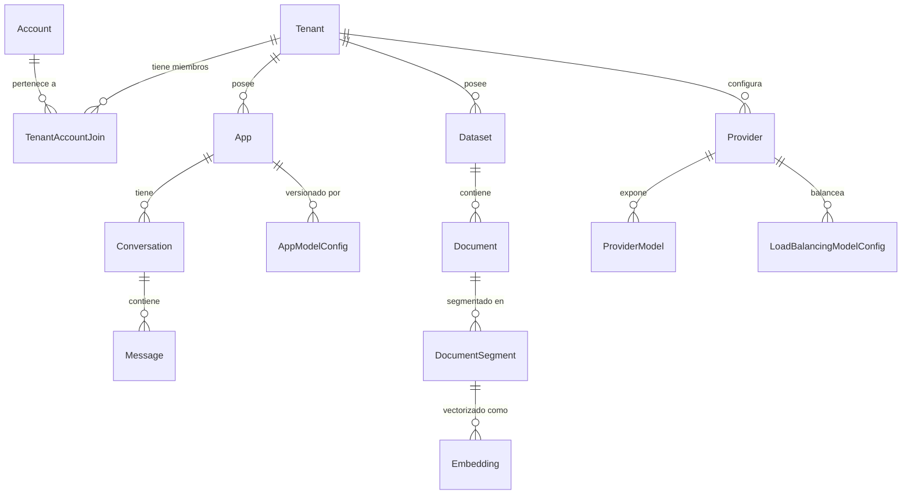
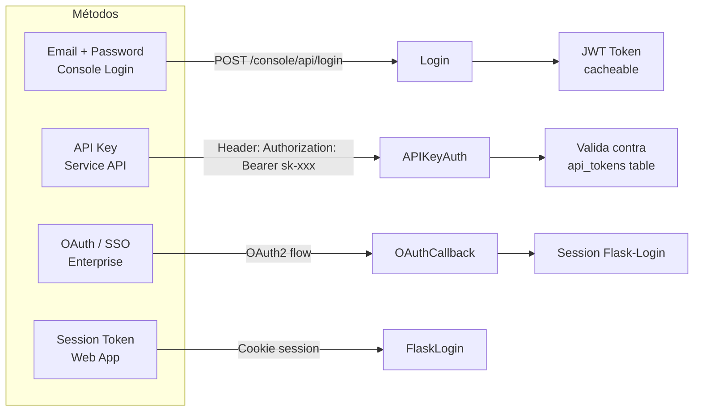
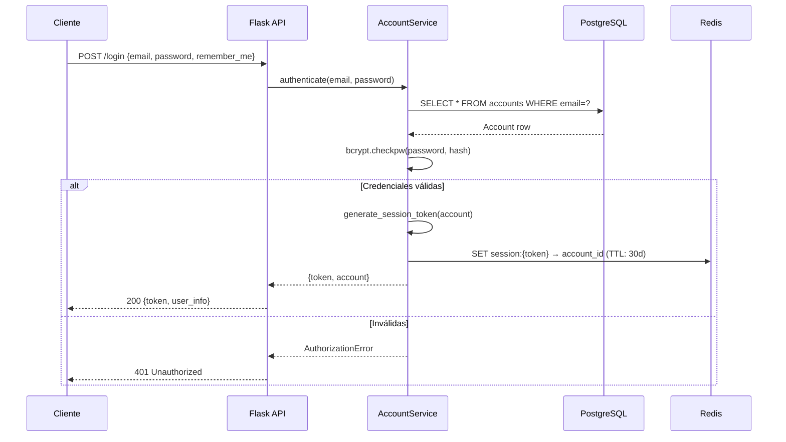
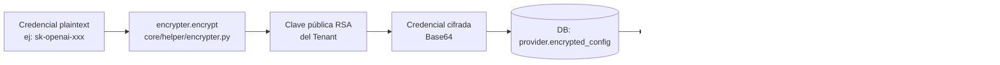

# Data Models y Autenticación — Dify Backend

## 1. Estructura de la Base de Datos

Dify usa **SQLAlchemy 2.0** con PostgreSQL. Todos los modelos heredan de `Base` definida en `models/base.py`. El patrón dominante es la **multi-tenancy** — prácticamente todas las tablas incluyen `tenant_id`.



## 2. Modelos Principales (ORM)

### 2.1 Account y Tenant (`models/account.py`)

```python
class Account(Base):
    __tablename__ = "accounts"
    id: str                     # UUID PK
    name: str
    email: str                  # Unique
    password: str               # bcrypt hash
    password_salt: str
    avatar: str | None
    interface_language: str     # Idioma preferido (en-US, es-ES, ...)
    interface_theme: str        # light | dark
    timezone: str
    last_login_at: datetime
    last_active_at: datetime
    status: AccountStatus       # active | banned | closed | pending
    initialized_at: datetime | None

class Tenant(Base):
    __tablename__ = "tenants"
    id: str                     # UUID PK
    name: str                   # Nombre del workspace
    encrypt_public_key: str     # RSA public key para cifrar credenciales
    plan: str                   # sandbox | professional | team | enterprise
    status: str                 # active | ...
    created_at: datetime

class TenantAccountJoin(Base):
    __tablename__ = "tenant_account_joins"
    tenant_id: str              # FK → Tenant
    account_id: str             # FK → Account
    role: str                   # owner | admin | editor | normal | dataset_operator
    current: bool               # Tenant activo del usuario
```

**Roles disponibles:**
| Rol | Descripción |
|---|---|
| `owner` | Control total, puede eliminar el workspace |
| `admin` | Administra miembros y configuración |
| `editor` | Crea y edita apps |
| `normal` | Solo puede usar apps |
| `dataset_operator` | Solo gestiona datasets |

### 2.2 App (`models/model.py`)

```python
class App(Base):
    __tablename__ = "apps"
    id: str
    tenant_id: str              # FK → Tenant
    name: str
    mode: str                   # chat | completion | agent-chat | workflow | advanced-chat
    icon_type: str              # emoji | image
    icon: str
    description: str
    enable_site: bool           # Web app habilitada
    enable_api: bool            # API pública habilitada
    api_rpm: int                # Rate limit requests/minuto
    api_rph: int                # Rate limit requests/hora
    is_public: bool
    is_universal: bool
    current_model_config_id: str  # FK → AppModelConfig (versión activa)

class AppModelConfig(Base):
    """Versión inmutable de la configuración de una app"""
    __tablename__ = "app_model_configs"
    app_id: str
    provider: str               # openai | anthropic | ...
    model_id: str               # gpt-4 | claude-3-5-sonnet | ...
    configs: dict               # JSON con toda la config
    opening_statement: str      # Mensaje de bienvenida
    suggested_questions: list   # Preguntas sugeridas
    pre_prompt: str             # System prompt
    agent_mode: dict            # Configuración del agente
    retriever_resource: dict    # Config RAG

class Conversation(Base):
    __tablename__ = "conversations"
    app_id: str
    model_provider: str
    model_id: str
    name: str
    summary: str | None
    inputs: dict                # Variables de entrada
    introduction: str
    system_instruction: str
    status: str                 # normal | archived | deleted
    from_source: str            # api | web_app | console
    from_end_user_id: str | None
    from_account_id: str | None

class Message(Base):
    __tablename__ = "messages"
    app_id: str
    conversation_id: str
    inputs: dict
    query: str                  # Mensaje del usuario
    answer: str                 # Respuesta del LLM
    message_tokens: int
    answer_tokens: int
    provider_response_latency: float
    total_price: Decimal
    currency: str
    status: str                 # normal | error | stopped
    error: str | None
    from_source: str
    from_end_user_id: str | None
    from_account_id: str | None
```

### 2.3 Dataset / Conocimiento (`models/dataset.py`)

```python
class Dataset(Base):
    __tablename__ = "datasets"
    tenant_id: str
    name: str
    description: str | None
    provider: str               # vendor | external
    permission: str             # only_me | all_team_members | partial_members
    data_source_type: str
    indexing_technique: str     # high_quality | economy
    embedding_model: str        # Modelo usado para embeddings
    embedding_model_provider: str
    retrieval_model: dict       # Configuración de retrieval
    collection_binding_id: str  # FK → DatasetCollectionBinding (vector store)
    word_count: int
    document_count: int

class Document(Base):
    __tablename__ = "documents"
    dataset_id: str
    position: int
    data_source_type: str       # upload_file | notion_page | website_crawl
    dataset_process_rule_id: str
    name: str
    created_from: str
    file_id: str | None
    word_count: int
    token_count: int
    indexing_status: str        # waiting | parsing | cleaning | splitting | indexing | completed | error
    enabled: bool
    error: str | None
    doc_metadata: dict          # Metadatos del documento original

class DocumentSegment(Base):
    __tablename__ = "document_segments"
    dataset_id: str
    document_id: str
    position: int
    content: str                # Texto del chunk
    answer: str | None          # Para QA datasets
    word_count: int
    token_count: int
    keywords: list              # Palabras clave extraídas
    index_node_id: str          # ID en el vector store
    status: str                 # waiting | indexing | completed | error
    enabled: bool
    hit_count: int              # Número de veces recuperado
```

### 2.4 Provider (`models/provider.py`)

```python
class Provider(Base):
    __tablename__ = "providers"
    tenant_id: str
    provider_name: str          # openai | anthropic | ollama | ...
    provider_type: str          # custom | system
    encrypted_config: str | None  # JSON cifrado con credenciales
    is_valid: bool
    token_is_set: bool

class ProviderModel(Base):
    __tablename__ = "provider_models"
    tenant_id: str
    provider_name: str
    model_name: str             # gpt-4o | claude-3-5-sonnet-20241022 | ...
    model_type: str             # llm | text_embedding | reranking | speech2text | tts | moderation
    encrypted_config: str | None
    is_valid: bool

class LoadBalancingModelConfig(Base):
    """Múltiples credenciales para el mismo modelo (load balancing)"""
    __tablename__ = "load_balancing_model_configs"
    tenant_id: str
    provider_name: str
    model_name: str
    model_type: str
    name: str                   # Nombre descriptivo de esta config
    encrypted_config: str
    enabled: bool

class TenantDefaultModel(Base):
    """Modelos por defecto del workspace"""
    __tablename__ = "tenant_default_models"
    tenant_id: str
    provider_name: str
    model_name: str
    model_type: str             # llm | embedding | reranking | ...
```

## 3. Tipos Personalizados (`models/types.py`)

```python
class StringUUID(TypeDecorator):
    """Almacena UUID como string en la DB para compatibilidad"""
    impl = String(36)

class LongText(TypeDecorator):
    """TEXT ilimitado, mapea a Text en SQLAlchemy"""
    impl = Text

class EnumText(TypeDecorator):
    """Enum almacenado como string"""
    impl = String
```

## 4. Flujo de Autenticación y Autorización

### 4.1 Métodos de Autenticación



### 4.2 Login con Email/Password

**Endpoint:** `POST /console/api/login`
**Controlador:** `controllers/console/auth/login.py`



### 4.3 Autenticación por API Key

**Header:** `Authorization: Bearer sk-xxxxxxxx`
**Archivo:** `services/auth/api_key_auth_service.py`

```python
# Flujo simplificado
def validate_api_key(api_key: str, tenant_id: str) -> ApiToken:
    token = db.session.query(ApiToken).filter_by(
        token=api_key,
        tenant_id=tenant_id,
        type="api"
    ).first()
    if not token:
        raise Unauthorized("Invalid API key")
    # Actualiza last_used_at
    token.last_used_at = datetime.utcnow()
    return token
```

### 4.4 Decoradores de Autorización

**Archivo:** `controllers/console/wraps.py`

```python
# Requiere sesión activa
@login_required
def my_endpoint(): ...

# Requiere rol mínimo en el tenant actual
@account_initialization_required
def my_endpoint(): ...

# Verifica permisos sobre un recurso específico
def get_app_model(app_id: str, mode: AppMode = None):
    app = db.session.query(App).filter_by(
        id=app_id,
        tenant_id=current_user.current_tenant_id
    ).first()
    if not app:
        raise NotFound("App not found")
    return app
```

### 4.5 License Check (Enterprise)

**Archivo:** `app_factory.py` — hook `before_request`

```python
@app.before_request
def before_request():
    init_request_context()
    
    # Solo en builds Enterprise
    if dify_config.ENTERPRISE_ENABLED:
        # Endpoints exentos del check
        exempt_paths = [
            "/console/api/system-features",
            "/console/api/setup",
            "/console/api/login",
            "/health",
        ]
        if request.path not in exempt_paths:
            status = EnterpriseService.get_cached_license_status()
            if status in (LicenseStatus.INACTIVE, LicenseStatus.EXPIRED, LicenseStatus.LOST):
                raise UnauthorizedAndForceLogout("License inactive")
```

## 5. Cifrado de Credenciales

Las credenciales de proveedores LLM se cifran antes de guardarse en la DB:



- Cada `Tenant` tiene un par de claves RSA generado al crear el workspace
- La clave pública se guarda en `tenants.encrypt_public_key`
- La clave privada se guarda cifrada en Redis con la `SECRET_KEY` de la app
- El descifrado ocurre en memoria justo antes de llamar al proveedor LLM

## 6. Migraciones de Base de Datos

Dify usa **Alembic** para migraciones:

```bash
# Crear nueva migración
flask db migrate -m "add column X to table Y"

# Aplicar migraciones pendientes
flask db upgrade

# Ver estado actual
flask db current

# Revertir última migración
flask db downgrade
```

**Archivos de migración:** `api/migrations/versions/`

Las migraciones se aplican automáticamente en el startup del container si se usa el script `docker/docker-entrypoint.sh`.

## 7. Índices y Performance

Las tablas críticas tienen índices compuestos en `(tenant_id, ...)`:

```sql
-- Ejemplo en DocumentSegment
CREATE INDEX idx_document_segment_tenant_dataset 
    ON document_segments(tenant_id, dataset_id);

CREATE INDEX idx_document_segment_node_id 
    ON document_segments(index_node_id);

-- Ejemplo en Message
CREATE INDEX idx_message_conversation 
    ON messages(conversation_id, created_at);
```
