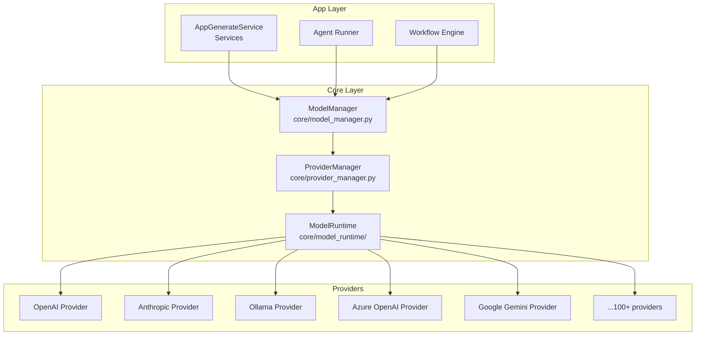
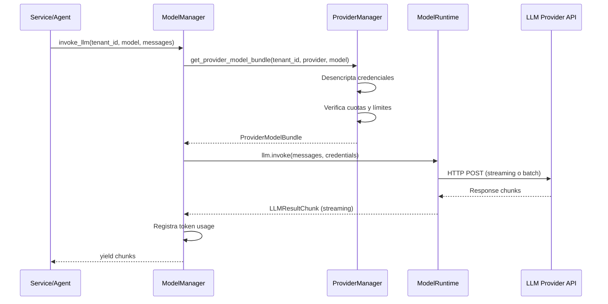
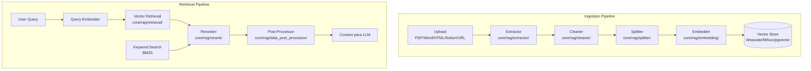
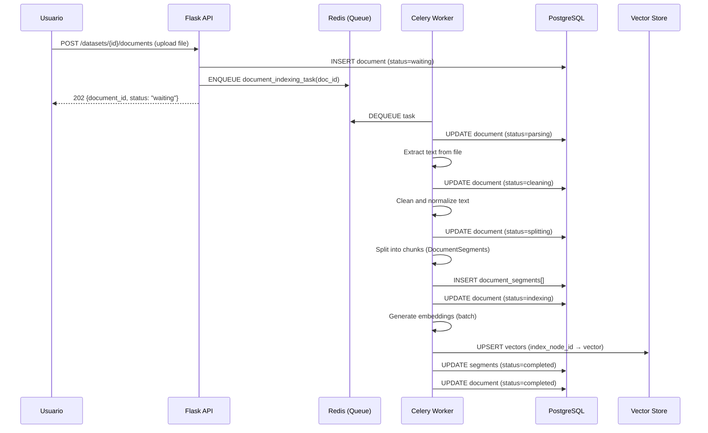
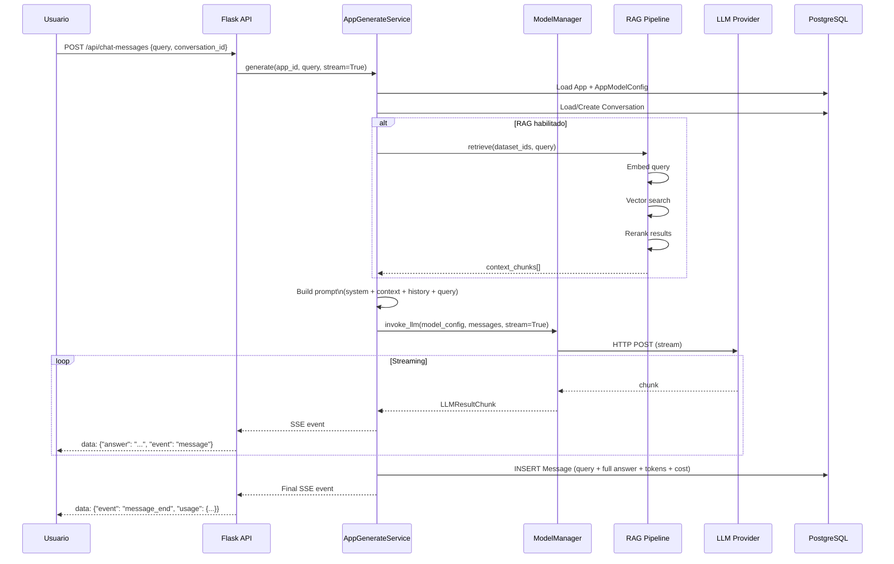
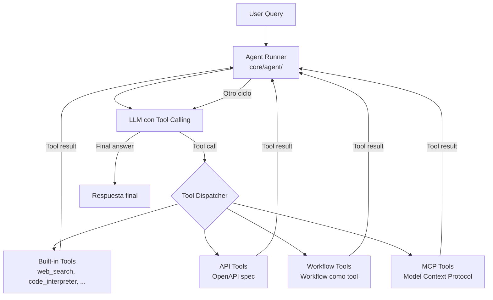

# LLM Providers, RAG Pipeline y Workers — Dify Backend

## 1. Arquitectura de Integración con LLMs

Dify abstrae todos los proveedores de LLM mediante una capa llamada **model-runtime** (`core/model_runtime/`). Cada proveedor implementa interfaces comunes, lo que permite añadir nuevos proveedores sin cambiar el código de la aplicación.



## 2. Sistema de Providers

### 2.1 Tipos de Providers

| Tipo | Descripción | Configuración |
|---|---|---|
| `system` | Proveedores gestionados por Dify (cuotas globales) | Sin credenciales del usuario |
| `custom` | Credenciales del usuario (BYOK) | Cifradas en DB por tenant |
| `hosting` | Proveedores hosteados por Dify (quota freemium) | Configuración centralizada |

### 2.2 Tipos de Modelos

Cada proveedor puede exponer varios tipos de modelos:

| Tipo | Uso |
|---|---|
| `llm` | Chat y completions |
| `text_embedding` | Generación de embeddings (RAG) |
| `reranking` | Reordenamiento de resultados RAG |
| `speech2text` | Transcripción de audio |
| `tts` | Text-to-speech |
| `moderation` | Moderación de contenido |

### 2.3 ProviderManager — Lógica Central

**Archivo:** `core/provider_manager.py`

```python
class ProviderManager:
    def get_configuration(self, tenant_id: str, provider_name: str) -> ProviderConfiguration:
        """
        Obtiene la configuración completa de un proveedor para un tenant.
        Incluye: credenciales, modelos disponibles, cuotas, load balancing.
        """
        
    def get_provider_model_bundle(
        self, 
        tenant_id: str, 
        provider: str, 
        model: str, 
        model_type: ModelType
    ) -> ProviderModelBundle:
        """
        Retorna el bundle listo para usar: proveedor + modelo + credenciales.
        Este bundle se pasa al ModelRuntime para ejecutar inferencia.
        """
```

### 2.4 ModelManager — Invocación de Modelos

**Archivo:** `core/model_manager.py`

```python
class ModelManager:
    def invoke_llm(
        self,
        tenant_id: str,
        model_config: ModelConfigWithCredentials,
        prompt_messages: list[PromptMessage],
        stream: bool = True,
        **kwargs
    ) -> LLMResult | Generator[LLMResultChunk]:
        """
        Punto único de entrada para llamadas LLM.
        Gestiona: credenciales, retry, logging, tracing, cuotas.
        """
```

**Flujo de una llamada LLM:**



## 3. Pipeline RAG (Retrieval-Augmented Generation)

### 3.1 Vista General del Pipeline



### 3.2 Extractores Soportados (`core/rag/extractor/`)

| Extractor | Formatos |
|---|---|
| PDF Extractor | `.pdf` |
| Word Extractor | `.docx`, `.doc` |
| Excel Extractor | `.xlsx`, `.xls` |
| CSV Extractor | `.csv` |
| HTML Extractor | `.html`, `.htm` |
| Markdown Extractor | `.md` |
| Text Extractor | `.txt` |
| Notion Extractor | Páginas Notion vía API |
| Unstructured Extractor | Múltiples formatos vía Unstructured.io |

### 3.3 Proceso de Indexación

**Disparador:** Al subir un documento, se encola una tarea Celery.



### 3.4 Técnicas de Indexación

**High Quality (por defecto):**
- Embeddings por chunk de texto
- Metadatos enriquecidos (keywords, summary)
- Mayor coste en tokens, mejor calidad de retrieval

**Economy:**
- Sin embeddings individuales por chunk
- Indexación BM25 keyword-based
- Menor coste, retrieval menos semántico

### 3.5 Métodos de Retrieval (`core/rag/retrieval/`)

| Método | Descripción |
|---|---|
| Vector similarity | Cosine similarity en el vector store |
| Keyword BM25 | Búsqueda léxica clásica |
| Hybrid | Combinación vector + keyword con alpha configurable |
| Full-text | PostgreSQL full-text search |

**Configuración en `Dataset.retrieval_model`:**
```json
{
    "search_method": "hybrid_search",
    "reranking_enable": true,
    "reranking_model": {"provider": "cohere", "model": "rerank-english-v3.0"},
    "top_k": 5,
    "score_threshold_enabled": true,
    "score_threshold": 0.5
}
```

### 3.6 Post-procesamiento (`core/rag/data_post_processor/`)

1. **Reranking**: Usa un modelo de reranking (Cohere, BGE, etc.) para reordenar los chunks recuperados por relevancia real.
2. **Score threshold**: Filtra chunks con score < umbral configurado.
3. **Context assembly**: Ensambla el contexto final para el prompt del LLM.

## 4. Workers Celery

### 4.1 Configuración del Worker

**Archivo:** `extensions/ext_celery.py`

```python
class FlaskTask(Task):
    """Wrapper que inyecta el contexto Flask en cada tarea"""
    def __call__(self, *args, **kwargs):
        with app.app_context():
            init_request_context()  # Logging context
            return self.run(*args, **kwargs)

# Configuración
celery_app.config_from_object({
    "broker_url": dify_config.CELERY_BROKER_URL,
    "result_backend": dify_config.CELERY_RESULT_BACKEND,
    "task_serializer": "json",
    "result_serializer": "json",
    "accept_content": ["json"],
    "timezone": "UTC",
    "enable_utc": True,
})
```

**Arrancar worker:**
```bash
celery -A app.celery worker --loglevel=info --concurrency=4
```

### 4.2 Catálogo de Tareas (`tasks/`)

#### Indexación de Documentos

| Tarea | Archivo | Descripción |
|---|---|---|
| `document_indexing_task` | `document_indexing_task.py` | Pipeline completo de indexación |
| `deal_dataset_vector_index_task` | `deal_dataset_vector_index_task.py` | Reindexar vectores |
| `clean_dataset_task` | `clean_dataset_task.py` | Limpiar dataset eliminado |
| `delete_segment_from_index_task` | `delete_segment_from_index_task.py` | Eliminar segmento del VS |
| `recover_document_indexing_task` | `recover_document_indexing_task.py` | Reintentar documentos fallidos |

#### Workflows y Generación

| Tarea | Archivo | Descripción |
|---|---|---|
| `async_workflow_tasks` | `async_workflow_tasks.py` | Ejecución asíncrona de workflows |
| `app_generate` | `app_generate/` | Generación de apps desde prompts |
| `annotation` | `annotation/` | Procesamiento de anotaciones |

#### Email y Notificaciones

| Tarea | Archivo | Descripción |
|---|---|---|
| `mail_invite_member_task` | `mail_invite_member_task.py` | Email de invitación |
| `mail_reset_password_task` | `mail_reset_password_task.py` | Email de reset de password |
| `mail_email_code_login_task` | `mail_email_code_login_task.py` | Código de login por email |
| `mail_account_deletion_task` | `mail_account_deletion_task.py` | Confirmación de eliminación |

#### Mantenimiento

| Tarea | Archivo | Descripción |
|---|---|---|
| `clean_unused_datasets_task` | `clean_unused_datasets_task.py` | Purga datasets huérfanos |
| `clean_embedding_cache_task` | `clean_embedding_cache_task.py` | Limpia caché de embeddings |
| `human_input_timeout_tasks` | `human_input_timeout_tasks.py` | Timeout de formularios humanos |

### 4.3 Tareas Programadas (Celery Beat)

**Archivo:** `schedule/` + configuración en `extensions/ext_celery.py`

```python
beat_schedule = {
    "clean_embedding_cache": {
        "task": "schedule.clean_embedding_cache_task.clean_embedding_cache",
        "schedule": crontab(hour=2, minute=0),  # Diariamente a las 2 AM
    },
    "clean_unused_datasets": {
        "task": "schedule.clean_unused_datasets_task.clean_unused_datasets",
        "schedule": crontab(hour=3, minute=0),  # Diariamente a las 3 AM
    },
    "clean_messages": {
        "task": "schedule.clean_messages.clean_messages",
        "schedule": crontab(hour=4, minute=0),
    },
    "check_upgradable_plugins": {
        "task": "schedule.check_upgradable_plugin_task",
        "schedule": timedelta(minutes=15),  # Cada 15 minutos
    },
    "workflow_schedule": {
        "task": "schedule.workflow_schedule_task",
        "schedule": timedelta(seconds=dify_config.WORKFLOW_SCHEDULE_TASK_INTERVAL),
    },
}
```

**Arrancar Beat:**
```bash
celery -A app.celery beat --loglevel=info
```

### 4.4 Monitoreo de Tareas

Las tareas se registran en la tabla `celery_tasks` (modelo `CeleryTask` en `models/task.py`). El estado se puede consultar vía:

```python
from celery.result import AsyncResult

result = AsyncResult(task_id)
print(result.status)  # PENDING | STARTED | SUCCESS | FAILURE | RETRY
print(result.result)  # Return value o excepción
```

## 5. Flujo de Chat Completo (E2E)



## 6. Sistema de Agentes

Los agentes en Dify son apps de modo `agent-chat` que ejecutan un loop de razonamiento con herramientas.



**Herramientas built-in disponibles** (`core/tools/builtin_tool/`):
- `web_search` — Búsqueda web (Google, Bing, DuckDuckGo)
- `code_interpreter` — Ejecuta código Python en sandbox
- `dalle` — Generación de imágenes DALL-E
- `wikipedia` — Consultas a Wikipedia
- `chart` — Generación de gráficas
- `file_operations` — Operaciones de archivos
- Y más de 50 herramientas adicionales
